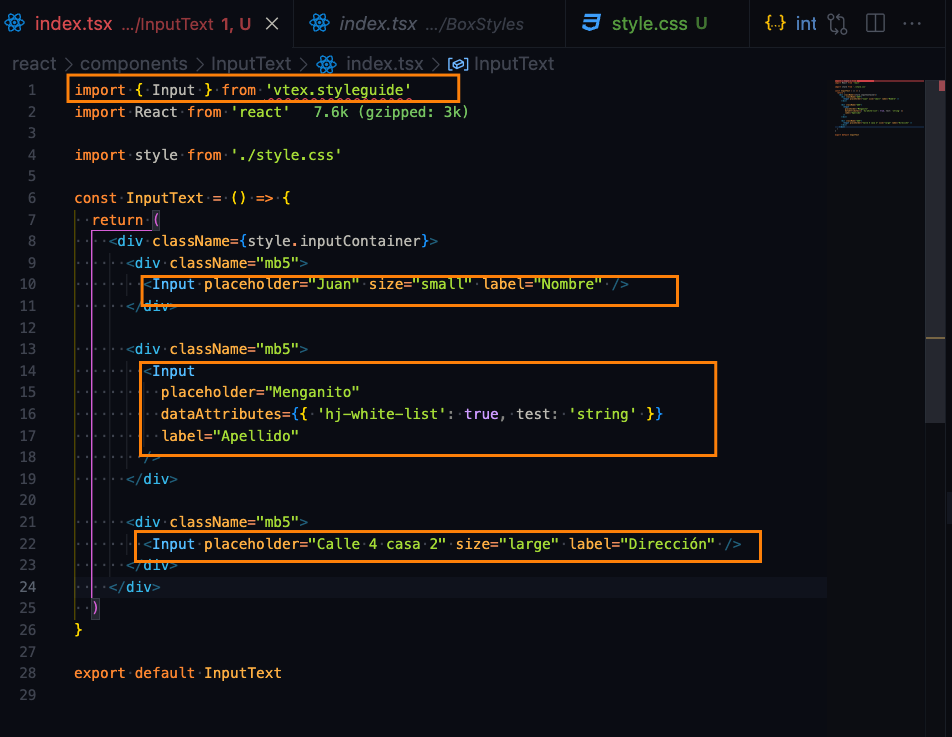

# Estandarización de proyectos

En este repositorio reposa la documentación necesaria para la creación de proyectos en IT Globers, bajo los estándares establecidos por la compañía, en los que se invita a participar en mejoras continuas y sugerencias por parte del equipo de desarrollo.

Para lograr un desarrollo óptimo, se debe solicitar al **Project Manager y al Tech Lead** encargados, con el cumplimiento puntual de los siguientes puntos para un trabajo armónico y eficiente por el equipo de desarrolladores involucrados en el proyecto.

## Historias de usuarios

Las historias de usuario son levantadas por parte de el(los) Project Manager, Tech Lead de IT Globers en un trabajo conjunto con el(la) Product Owner del proyecto, cumpliendo con los siguientes puntos:

- Los requerimientos deben tener la mayor descripción posible, tanto en funcionalidad como aspecto visual que tendrá la historia de usuario, en caso de ser una vista. No se deberá dejar bajo ningún motivo, requerimientos a interpretación **subjetiva** por parte de cualquiera de los involucrados.
- Tiempo en las entregas, estos tiempos deben ser evaluados con el equipo técnico, Project Manager y Líder técnico. Buscando la mayor acertividad en complejidad en el desarrollo del requerimiento planteado por el cliente
- Siempre deben existir componentes de guía o apoyo visual, referentes a lo que busca como resultado final el Product Owner y Usuario Final.
- En caso de que se levanten nuevas Historias de usuario durante el desarrollo del proyecto, éstas deben cumplir con las mismas especificaciones anteriormente nombradas, y seguir la linea de la estandarización mencionada.
- Siempre aclarar al cliente que los tiempos de entrega podrían sufrir cambios si se agregan historias de Usuario adicionales.

- La historia de usuario deberá tener el siguiente formato:

### RFC (Request For Commits)

Es un documento donde se plasmarán los componentes (custom o nativos) a usar dentro del proyecto, dando claridad de cuál ruta seguir para cada historia de usuario establecida con el siguiente formato.

- Nombre del proyecto
- Tecnologías/componentes a usar y por qué.
- Una descripción detallada del componente y la forma de implementarlo o una documentación acertada de cómo hacerlo.

**Ejemplo:**
`Header`: se usara un `header-row` como contenedor general del header y ya cada sub-header sera con un `flex-layout.row` etc... Porque de esta manera sera mas practico al momento de darle estilos etc...

## Tareas en Jira

Dentro de las tareas de Jira debe reposar la siguiente información para un fácil abordaje por parte del desarrollador.

- Historia de usuario
- Documentación del RFC
- Apoyo visual en resoluciones `phone, tablet, desktop`, (Figma o imágenes)
- Link de referencia en caso de estar emulando un sitio.

## Inicialización del proyecto

Los proyectos realizados por ITGlobers manejarán un estándar basado en cuatro repositorios base que se trabajarán de la siguiente manera:

- {vendor}.store-theme (Tema base)
- {vendor}.frontend-applications (Apps custom frontend)
- {vendor}.backend-services (Servicios y middlewares)
- {vendor}.checkout (App para checkout)

## {vendor}.store-theme

Para realizar la inicialización del proyecto, Este repositorio que contien el tema base de la tienda, y se debe renombrar a `vendor.store-theme`, donde `vendor` es el nombre del cliente.

### {vendor}.frontend-applications

El Tech Lead del proyecto deberá crear un repositorio basado en [VTEX React App Template](https://github.com/vtex-apps/react-app-template), en el que se alojarán todas las apps front end customizadas del proyecto.

Se deberá nombrar desde `manifest.json` de la siguiente forma

```json
{vendor}.frontend-applications
```

### {vendor}.backend-services

El Tech Lead del proyecto debe hacer la solicitud de los permisos de la siguiente aplicación

Se deberá nombrar desde `manifest.json` de la siguiente forma y se pedirán los siguientes builders:

```json
{vendor}.backend-services
Esta aplicación tendrá acceso a los builders
"graphql": "{version}.x",
 "node": "{version}.x",
 ".NET": "{version}.x",
```

[Link para hacer la solicitud](<[https://docs.google.com/forms/d/e/1FAIpQLSfhuhFxvezMhPEoFlN9yFEkUifGQlGP4HmJQgx6GP32WZchBw/viewform](https://docs.google.com/forms/d/e/1FAIpQLSfhuhFxvezMhPEoFlN9yFEkUifGQlGP4HmJQgx6GP32WZchBw/viewform?authuser=3)>)

En esta Aplicación se alojaran los servicios backend.

### {vendor}.checkout-ui-settings

El Tech Lead del proyecto deberá crear un repositorio basado en en el "checkout-ui-settings" corriendo en la CLI el comando:

```bash
vtex init
```

Y seleccionando la opcion de checkout-ui-settings.

Que nos dara un repo como: [VTEX Checkout](https://github.com/vtex-apps/checkout-ui-settings), en el que se alojarán todos los scripts y estilos base del checkout que se programan con css y Vanilla JS o TypeScript, (No se aconseja el uso de JQuery).

Esto con el fin de mantener los logs y relases de el checkout en un solo lugar. y que sea más facil de escalar.

Se deberá nombrar desde `manifest.json` de la siguiente forma

```json
{vendor}.checkout-ui-settings
```

# Configuraciones Iniciales al Store Theme

En el archivo de styles.json `styles/configs/style.json` se puede configurar colores, fuentes, tamaños, espacios, etc. De manera directa al theme. Lo cual es el primer lugar que debemos adaptar a los requerimientos del proyecto.


## Estandarización de CSS

### Estructura Inicial

Para que los nuevos estándares y el proyecto funcionen correctamente, es necesario crear un nuevo archivo en la raíz de la Carpeta Global CSS, como sigue:

- Crea un nuevo archivo llamado `vtex.store.css` en la carpeta CSS


- Y a continuación, añade las variables deseadas dentro del archivo

```
:global(.vtex-store__template) {
  --promotions-color: #ffed00;
  --green-offers: #289e36;
  --discounts: #7ac537;
  --dynamic-texts: #843a8d;
  --card-descriptions: #c47373;
  --promotion-flags: #525252;
}
```

Aquí podemos poner variables que necesitemos como colores, tamaños, fuentes, etc. que no se permitan configurar en el `styles.json` , el cual es mayormente usado para variables de colores. De esta forma, las variables quedan disponibles en toda la app para su uso.

_Como `vtex-store__template` es una clase global, podemos usar variables CSS para casos específicos y mejores personalizaciones de nuestros estilos_

## Estructura del Código

Para la implementación del código, utilizaremos la [Metodología BEM](https://en.bem.info/methodology/)

<p align="center">
  
</p>

## Bloques y Nombres de Clases

Como ya estamos utilizando la Metodología BEM dentro de los bloques VTEX IO, esta es la forma que utilizaremos para implementar la metodología pero en las clases CSS. e,i:

Si un bloque nativo se llama `"header-row#desktop__container-header"` simplemente debemos nombrar la clase CSS basada en el alias del bloque.

_bloque principal:_

```json
"header-row#desktop__container-header": {
    "children": [
      "image#header__contact--logo",
      "rich-text#header__contact--title"
    ]
  }
```

_bloque principal con clase css (` "blockClass": "desktop__container-header"`):_

```json
"header-row#desktop__container-header": {
    "children": [
      "image#header__contact--logo",
      "rich-text#header__contact--title"
    ],
    "props": {
      "blockClass": "desktop__container-header"
    }
  }
```

_Nota: En el caso de que sea necesario utilizar más clases dentro del mismo bloque, puedes utilizar un array en la propiedad `blockClass`, pero recuerda nombrar la clase utilizando la Metodología BEM:_

```json
"header-row#desktop__container-header": {
    "children": [
      "image#header__contact--logo",
      "rich-text#header__contact--title"
    ],
    "props": {
      "blockClass": [
        "desktop__container-header",
        "example__example",
        "example__example--example"
      ]
    }
  }
```

## Formato del Código

Así como es importante tener un estándar sólido en la estructura del código, también es importante que se vea bien y esté correctamente formateado a través de todos los cambios que el equipo hace.

Por esta razón, es necesario instalar [Formate: CSS/LESS/SCSS formatter](https://marketplace.visualstudio.com/items?itemName=MikeBovenlander.formate), un plugin de VSCode para formatear tus archivos CSS / LESS y SCSS que puede alinear verticalmente las propiedades.

<p align="center">
  
</p>


De esta manera, podemos ver fácilmente nuestro código y hacer cambios a medida que aparecen nuevas características.

## Estructura de carpetas

Tener un ordenamiento simétrico y constante nos ayuda a mantener proyectos limpios y escalables, sobre todo a que otras personas lo puedan entender en un tiempo menor.

Por lo cual tenemos que pensar en los proyectos VTEX IO como un organismo que no muta si no que se extiende como las clases en POO.
Para ello debemos pensar en la construcción del esquema de los folders con 4 puntos de partida

1- Desktop
2- Mobile o phone (Según requiera)
3- Tablet
4- Global

Por qué desde estos cuatro puntos de partida?
Porque son las vistas generales en que el cliente ve nuestro producto, Global seria para los file que no se modifican según su vista.


#### Estructura interna de cada carpeta.

Para las folders nombradas (Desktop, Mobile, Tablet y Global), se organizan de manera interna en 2 sub-Folders:

Desktop
=> Components: Contendra todos los componentes que pueda requerir la vista.
=> screen: Contiene los componentes principales que conforman páginas o la página en si misma.

En los folders componentes cada file debe ir con el nombre de su elemento padre, como se ve en la imagen `header-menu.jsonc` es el componente hijo de `header` asi podemos relacionar un componente con su children.


### Folder Global

En este folder irán los elementos que son iguales en todas las vistas (phone, tablet, desktop), con las mismas dos carpetas internas, `components`, `screen`.
En el caso que se desee usar un componente global, pero se necesite hacer una extensión de estilos CSS, se agregará una clase adicional en un array del nuevo componente, agregando los estilos CSS adicionales requeridos.

```json

/.json - info card se usa en el home
{
    "flex-layout.row#global__info-card": {
        "children": [...],
        "props": {
            "blockClass": "global__info-card"
        }
    }
}

//vtex.flex-layout.css
.global__info-card {
    background-color: blue;
    color: white;
    font-size: 18px;
    width: 100%;
}

//.json - info card se usa en la página de producto, pero tiene un cambio a su color de fondo

{
    "flex-layout.row#global__info-card--pdp": {
        "children": [...],
        "props": {
            "blockClass": ["global__info-card", "global__info-card--pdp"]
        }
    }
}

//vtex.flex-layout.css
.global__info-card--pdp {
    background-color: orange;
}
```

¿Por qué? porque así evitamos chocar con las media querys nativas del navegador.

## Folders de css

Se crearán folders por componentes de el proyectos, es decir, si tenemos en el footer un fqa, tendriamos una carpeta que diga footer en su interior uno con el nombre del fqa.
Ejemplo:


Para de esta manera el elemento footer-fqa sera un componente reutilizable en cualquier proyecto sin importar las reglas de negocio o cliente.

## Carpetas files y fonts

- Para los carpetas `files` y `fonts` no se requiere crear la estructura de las carpetas por vista, ya que contiene files únicos del proyecto y que sirven a todas las vistas. Pero sin cerrarse a que pueda existir esa discriminación por vista.
- Para `imagenes` se van a subir a arquivos. El nombramiento de cada imagen se llevará de la misma manera que los de componentes padres a hijos, ejemplo:
  `header__logo-marca.png`
  `header__icon-cart.png` etc.

* Para los `svg` se manejaran dentro de la carpeta assets del proyecto.

#### Hay dos "Principios o estándares" Para iniciar un proyecto:

a- Mobile first  
b- Desktop first

En ITGlobers si es un project responsive iniciamos con Mobile first, ¿por qué? porque +70% del tráfico en internet se hace desde un dispositivo mobile.

Para esto debemos usar el responsive layout, quien nos permitirá manejar elementos diferentes en cada vista, ya sea que cambien el componente por completo o en su orden.

## Nombre a los archivos y clases.css de los proyecto con la metodologia BEM

`Block-element-modifier`

¿Por qué hacerlo con BEM? Bueno BEM es una metodología usada en las hojas de styles para manejar mucho mejor la especificidad, lo cual aprovecharemos en IT Globers para nombrar componentes de VTEX IO y evitar que se repitan nombres o se pisen, igualmente para los files además de su uso en el CSS.

#### Nombrando bloques

Bloques de VTEX IO como `header-row`, `flex-layout.row`, `flex-layout.col`, `store.custom`, `store.home`, etc. Son nombres nativos en VTEX IO y les podemos agregar alias poniendo después de nombre por defecto un #, `flex-layout.row#{alias}`

Y aquí es donde pondremos en uso la metodología BEM para el nombramiento del alias.
Primero nombramos la vista (desktop, mobile, tablet o global) seguido de `__` nombre del component.

Si el bloque es un children vamos a manejar su nombre:

Primero nombramos la vista `flex-layout.row#desktop` seguido de `__` nombre del elemento padre `flex-layout.row#desktop__header` y por último el del componente hijo que estás creando `flex-layout.row#desktop__header--contact`

```json
 "header-row#desktop__container-header": {
	 "children": [
		 "flex-layout.row#desktop__header--contact",
		 "flex-layout.row#global__header--menu"// para cuando el componente esta en las 3 vistas, mobile, dekstop, tablet usamos "global"
	 ]
 },
```

Que pasa si tienes muchos componentes anidados, para el 3er nivel de anidamiento se toma ya el elemento padre como principal y no la vista, ejemplo:

`flex-layout.row#desktop__header--contact` y este elemento tiene un children, seria así:

```json
 "flex-layout.row#desktop__header--contact": {
	 "children": [
		 "ritch-text#header__contact--title",
		 "Image#header__contact--logo"// para cuando el componente esta en las 3 vistas, mobile, dekstop, tablet usamos "global"
	 ]
 },
```

#### Nombrando clases

Con las clases en los bloques es más práctico porque simplemente es ponerle el mismo alias del bloque como class en el css.

```json
 "header-row#desktop__container-header": {
	 "children": [
		 "flex-layout.row#desktop__header--contact",
		 "flex-layout.row#global__header--menu"// para cuando el componente esta en las 3 vistas, mobile, dekstop, tablet usamos "global"
	 ],
	 "props": {
		 "blockClass": "desktop__container-header",
		 "fullWidth": "true"
	 }
 },
```

También tener en cuenta que en algunos proyectos es necesario reutilizar componentes con unas pequeñas variaciones en los styles, lo cual podemos hacer uso del array de classes que se puede manejar en Vtex.

```json
 "header-row#desktop__container-header": {
	 "children": [
		 "flex-layout.row#desktop__header--contact",
		 "flex-layout.row#global__header--menu"// para cuando el componente esta en las 3 vistas, mobile, dekstop, tablet usamos "global"
	 ],
	 "props": {
		 "blockClass": [
			 "desktop__container-header",
			 "Variante__uno",
			 "variante__dos"
			],
		 "fullWidth": "true"
	 }
 },
```

#### Nombrando files

El nombramiento de los files `.jsonc` es de igual manera simple y práctico, si hablamos de un bloque principal como `'header', 'footer', 'home', 'product-page'` etc. El nombre del file solo llevará el mismo nombre con la extensión 'header.jsonc', `'footer.jsonc', 'home.jsonc', 'product-page.jsonc'`, Si el file es un componente hijo como:

`header.jsonc` tiene un componente hijo que es el `menu`entonces el file del menú se llamara `header-menu.jsonc`.

# Nota:

- Todo elemento en el .jsonc debe llevar el `title` con el fin de facilitar el manejo del back office.
  
  
- Para los componentes que manejan mucha informacion de manera plana, como lo TyC, debemos manejar los archivos markdown.
  

## Commits, Pull Request, Merge and Create Branch

Creación de Ramas en github se hará desde la parte de Jira de crear branch para tener el nombre.

#### Estándar en los commits <a href="https://gist.github.com/joshbuchea/6f47e86d2510bce28f8e7f42ae84c716">DOCS</a>

```json
	<type>(<scope>): <subject> <-- description -->

example:
		   <feat>(<header>): <create header with drop-down menu > <-- add drop-down menu for categories with redirect -->
```

### Ejemplos de Scope

<hr>

Feat,
Fix,
style,
Chore.

#### Pull request => que muestres que branch es la que entra y a cual ejemplo:

```json

example:

**##feat<header-USA#342>:** create header with drop-down menu
|--> **description:**<!--add drop-down menu for categories with redirect.-->
|--> **How to test it?:** <!--- Don't forget to add a link to a Workspace where this branch is linked -->[Workspace](Link goes here!)
|--> **How does this PR make you feel?:**[:eslabón:](https://a.slack-edge.com/production-standard-emoji-assets/13.0/google-medium/1f517.png)****](**[http://giphy.com/](http://giphy.com/)**)
|--> **#### Screenshots or example usage:**<!--- Add some images or gifs to showcase changes in behaviour or layout. Example: before and after images, use only browser of GitHub-->
|--> **Does it depend on another component?:** <!---if depent of any apps-->								 |--> **url-custom-apps:** <!---link a apps donde los proyectos necesiten de ellas para	funcionar.-->
|--> **name-element-additional:** <!--mensaje-elemento-adicional
```

#### Merge

- Antes de cualquier merge el PR debe tener como mínimo la revisión del TL.
- Para los merge de cada proyecto el responsable será el TL o quien a criterio del TL sea el encargado.

## Readme

Cada proyecto debe tener su readme.md al detalle de que hace su componente, elemento o aplicación. Con el fin de ayudar a los demás a entender su uso y comportamiento.

Ejemplo:

#### CardsCatalogos

Es una app que recibe un script de tiendeo.com.co el cual contiene toda la información del catálogo de tiendas Jumbo.

```tsx
import React, {
  useEffect,
} from "react";
const CardsCatalogos =
  () => {
    useEffect(() => {
      const script =
        document.createElement(
          "script"
        );
      script.src =
        "https://www.tiendeo.com.co/_integrations/slider.js?origin=jumbo";
      script.async =
        true;
      document
        .getElementById(
          "tiendeo_container"
        )
        ?.appendChild(
          script
        );
      return () => {
        document
          .getElementById(
            "tiendeo_container"
          )
          ?.removeChild(
            script
          );
        const where =
          document.getElementById(
            "__tiendeoViewerContainer"
          );
        if (where) {
          where.style.display =
            "none";
        }
      };
    }, []);
    return (
      <div id="tiendeo_container" />
    );
  };
export default CardsCatalogos;
```

#### Configuration

<hr>

Importe `tiendasjumboqaio.jumbo-general-apps`_ en las dependencias del tema _`manifest.json`

```json
"dependencies": {
"tiendasjumboqaio.jumbo-general-apps"
}
```

Adicione el bloque de _`"cards-catalogos"`_ en cualquier plantilla de su tema.

```json
 "flex-layout.row#catalogos__body": {
 "children": ["cards-catalogos"]
 },
```

Del lado del cliente se renderiza en un landing de catálogos disponibles.

| Prop name | Type | Description | Default value |
| --------- | ---- | ----------- | ------------- |

<br>
<br>

### Handles

<hr>

**CSS Modules**

- containerBanner
- containerTitle
- labelTitle
- spanTitle
- animateText
- imageBanner
- isBig

# Apps Custom

Deberán vivir en un monorepo todas las apps pequeñas que no requieran una integración muy compleja o peerDependecies (apps presentacionales), con esto buscamos que se mas fácil su almacenamiento y manejo de los componentes. Además de que se pueda agregar a la aplicación de manera mas sencilla.

Para la creación de sus componentes se deberá usar en primera instancia los [Style-guide](https://styleguide.vtex.com/#/Introduction) de Vtex IO, de no estar el componente o elemento en los style-guide se procederá a generar de manera manual, dejando su correcta documentación y uso.

Ejemplos de implementación:



Renderizado:


<hr>
<br>
<br>

# Estilos de las app custom

Cada app custom debe mantener estilos base, es decir, estilos de espaciados, position, animaciones, funcionalidad, etc. usando estilos en el order de prioridad:

1. **Tachyons** (Libreria que maneja los styles de Vtex IO)

2. **CSS Modules** (para estilos de personalizados de la app, para el nombramiento de el archivo de CSS usaremos el " **style.modules.css** " )

3. **CSS Handles** (para estilos de personalizados de la app que son agregados desde el store theme, esto para agregar el look and feel del store)

Documentación de referemcia: [Reglas de uso](https://developers.vtex.com/vtex-developer-docs/docs/vtex-io-documentation-5-defining-styles)

Esto con el fin de mantener las apps custom agnósticas a cada lógica de negocio y proyecto en particular, con el fin de que sea reutilizable en diferentes proyectos.
